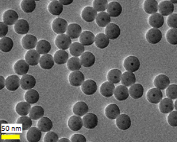
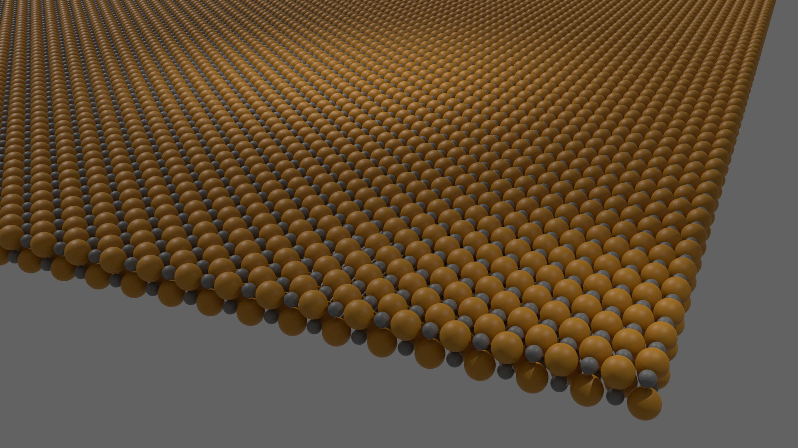
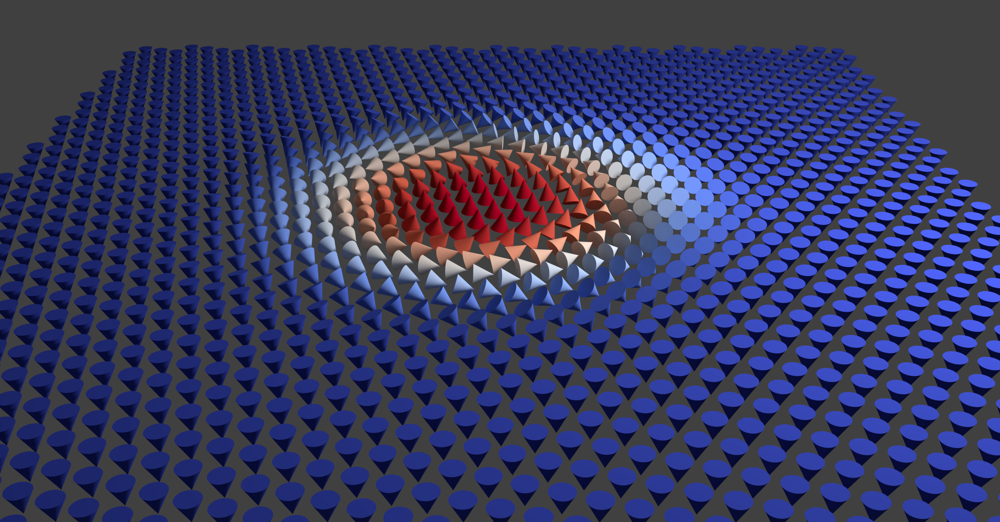

+++
date = '2024-11-02T11:25:47-07:00'
title = 'Research'
+++

## Nanoparticles

{.center}

Structures confined to nanometer length scales in one or more dimensions can
possess strikingly different properties than in bulk. In contrast to bulk
materials, low dimensional systems such as nanodots (0D), nanowires (1D), and
thin films (2D) have a much larger fraction of their atoms on the surface. As a
result, surface physics and interfaces between materials play a much larger role
in the overall behavior of these systems. By varying their morphology and
composition, their properties can be tailored for applications in pure research
or for consumer technology.

## First Order Reversal Curves (FORC)

Magnetic materials are widely used in consumer products, industry, and in
research applications. Utilizing these materials in device applications requires
an understanding of their behavior from the macroscopic level all the way down
to atomic length scales. Alongside micromagnetic simulations
([OOMMF](https://math.nist.gov/oommf/), [Mumax3](http://mumax.github.io/)), one
of the major tools I have used to understand hysteretic behavior is the [First
Order Reversal Curve (FORC)
technique](https://doi.org/10.1038/s41598-021-83349-z). While simple major loop
measurements can yield information about the average magnetization of an
ensemble of magnetic moments, FORC analysis allows individual switching events
to be probed, revealing microscopic details about iteractions between magnetic
moments.

## Magnetoionics

Conventional logic and memory technologies which rely on electric currents
suffer from Joule heating, limiting their energy efficiency, and are volatile,
which requires devices to remain powered in order to maintain their state. The
ability to control magnetic materials with electric fields should enable a new
generation of nonvolatile memory devices that do not require electric currents,
circumventing this limitation. One promising approach towards electric field
control of magnetism has focused on solid-state manipulation of ion
distributions. My work has focused on the development of methods for
chemically-induced and electric-field-induced ionic motion.

## Chiral Magnetism

In certain bulk materials or thin film systems, competing magnetic interactions
can lead to winding magnetization textures known as skyrmions. These
particle-like textures resemble magnetic vortices, and have extraordinary
properties which make them of particular interest both for fundamental physics
as well as for nonvolatile, ultra-fast, and low-dissipation storage and logic
applications. As part of my doctoral work, I carried out resistivity
measurements in search of Hall effect signatures of skyrmions in novel
artificial skyrmion lattices.
