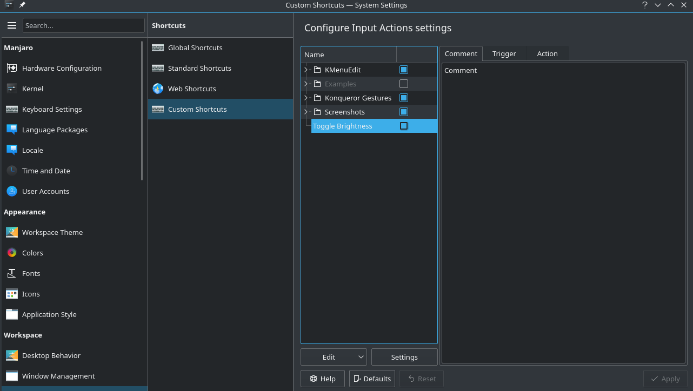

I'm one of those people who likes having everything on my devices set to night mode. It's becoming
more common to see dark themes everywhere, but I still rely on tools like the
[Stylus](https://chrome.google.com/webstore/detail/stylus/clngdbkpkpeebahjckkjfobafhncgmne?hl=en)
plugin for firefox/chrome (with dark themes installed for all of my favorite websites), which
absolutely saves my eyeballs. And at night I like to dim my desktop monitors so that I don't get
blinded by any white light I can't really avoid. It turns out that doing this can be kind of tricky
with X11. When I tried to find information about how to do this the discussion was most often
focused on laptop brightness control - but there was hardly ever mention of controlling brightness
on desktop monitors. It took me a little while but I figured out a good way to do this using xrandr
and some scripting. I've written a line-by-line walkthrough of the bash script I wrote in case
you're interested, but if not just scroll to the bottom if you want my script file.

In the console, we can find the brightness of the current monitors using `xrandr --verbose`. This
command produces a massive wall of text with configurations for each attached monitor, and the
brightness of each monitor is buried in there if you look closely. The relevant line looks like
this:

```
Brightness: 1.0
```

We can grab the line containing the brightness from this output by piping it into `grep` and then
clip out the actual value using `cut`:

```bash
BRIGHTNESS=`xrandr --verbose | grep -m 1 -i brightness | cut -f2 -d ' '`
```

Let's break it down:

1. `grep` is used to search a file or string. In our case, it is searching the output of `xrandr --verbose`.
   _ `-m 1` tells `grep` to only return the first occurrance of our search term
   _ `-i` ignores case
2. `cut` is like Python's `str.split()` method - it returns pieces of the input, depending on the
   options you feed it.
   _ `-d ' '` is essentially the same as `str.split(' ')` in Python: it tells `cut` to separate the
   input into a list of strings, with a blank space as the separator.
   _ `-f2` tells `cut` to return the second string in the list.

The second thing we need to do is change the brightness of the monitor. This is done with `xrandr` as well:

```bash
xrandr --output <OUTPUT> --brightness <VALUE>
```

Here, `<OUTPUT>` is the name of the display you are using; you can see the connected displays using
`xrandr` with no arguments. `<VALUE>` is a float; 1.0 corresponds to the default brightness. For me,
my two displays were called DVI-D-0 and DP-1.

Now we just need to put it all together into a bash script:

```bash
BRIGHTNESS=`xrandr --verbose | grep -m 1 -i brightness | cut -f2 -d ' '`
NIGHTVALUE=0.6
DAYVALUE=1.0

if [ `echo "$BRIGHTNESS == 1.0" | bc` -eq 1 ]
then
        SETVALUE=$NIGHTVALUE
else
        SETVALUE=$DAYVALUE
fi

xrandr --output DVI-D-0 --brightness $SETVALUE
xrandr --output DP-1 --brightness $SETVALUE
```

If the brightess is 1.0, this script sets it to 0.6; if it is anything but 1.0, it sets the
brightness to 1.0. The only hiccup was that bash can't make floating point comparisons - so the
value of the brightness I got from `xrandr` couldn't be directly evaluated. Instead, you have to use
`bc`, which is made for this purpose. You can read up on the syntax for `bc`, but its use in the if
statement here is clear.

Save this as a .sh file, then do `sudo chmod +x <your_script>.sh` and voila! Whenever you run it
your screen brightness will be toggled. I tied this to my Pause/Break button in KDE using the Custom
Shortcuts settings:



Now, just hit the hotkey to toggle the brightness. This works by acting on the gamma values of the
display, so it isn't actual backlight control like you get from a laptop screen dimmer button, but
it will save your eyes at night!
