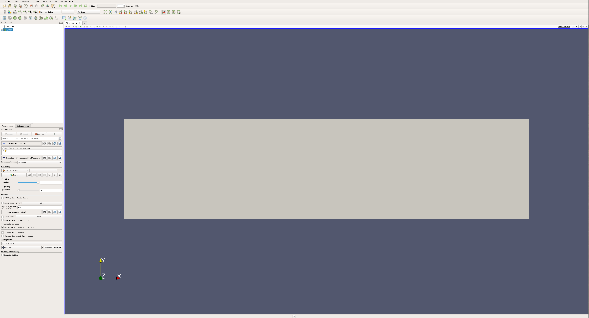

I simulate magnetic materials for science. The output of the [simulation
package](http://mumax.github.io/) that I use is a binary data format (ovf) which I then convert into
[VTK format](https://vtk.org/). These VTK files contain snapshots of my magnetic material at
different points in time, and they can be easily viewed and manipulated using
[Paraview](https://www.paraview.org/), a free and open source scientific data analysis and
visualization tool developed and maintained by [Kitware](https://www.kitware.com/). If you're
familiar with Kitware (cmake, vtk, ...), you probably already know that the documentation for these
tools is ...incomplete? A work in progress? Look, if you work at Kitware, I'm really sorry, this
isn't some sort of attack on you - I know how difficult good documentation can be. But there's a
really steep learning curve, so I'm hoping that showcasing how I use Paraview will help others get
over this barrier. Here's what the data looks like when I load it in:

My data is a bunch of vectors (here, representing magnetization) stored on a grid in 3D space. I can
visualize these vectors in a number of different ways. I can color my simulation region by a vector
component:

Or I can represent my vectors using _glyphs_, (here I use cones to show the direction, and color to
highlight the x-component of each vector):

This is great for investigating data, but you wouldn't want to use this for publications or serious
graphics. For that stuff, what you _need_ is ray tracing - you need
[blender](https://www.blender.org/)[^1]. Select your data in the Pipeline Browser and click
`File`->`Save Data...`. Save it as a .ply file, and at the prompt, be sure to save the color data
and alpha values[^2]. Then open up blender and choose `File`->`Import`->`Stanford (.ply)`, and load
your data. Voilà! Now you can add lighting, effects, animations, and whatever else you want.

When imported into Blender the entire dataset is imported as a single mesh (even if there were
multiple glyphs in your dataset in Paraview). Colormap data that was applied in Paraview gets
exported too, but by default it won't show up after the data has been imported. Instead of being
stored in a material, as color usually tends to be for blender objects, it is stored in the _mesh_.
To add the color back, first make sure you're using the Cycles render mode. In the `Properties`
area, open the `Object` tab, and under the collapsable `Vertex Colors` menu, you should see an entry
for an _attribute_ named `Col`. This is the name given to the color data by paraview. With the
imported data selected, open the `Node Editor`, create an `Attribute Node`, and enter `Col` into
the `Name` field:

Now, when the 3D view is set to `Rendered`, the imported mesh should be colored according to the
colormap that was applied in Paraview. From here, the possibilites are huge - you can get realistic
lighting, special effects, render movies, and make production quality visualizations which go way
beyond anything you've even seen on the cover of Nature. Here are just a few examples of my own
renders:

Although the images above were rendered using Blender 2.8, the same method works for Blender 2.79b.
Happy rendering!

[^1]:
    I am aware that ray tracing is possible in Paraview with OSPRay, but I haven't been able to
    figure out how to use it to any real effect. It doesn't look really much better than rasterization
    anyway, to say nothing of the customizable lighting, camera, texturing, and post-processing
    available in blender.

[^2]:
    It seems like saving only color data (and not alpha values) makes it impossible to display the
    data into blender. I'm not sure if this is intended behavior or not, or whether it is an issue
    with Paraview or with blender, but when you import your file in blender the glyphs are just
    missing.
