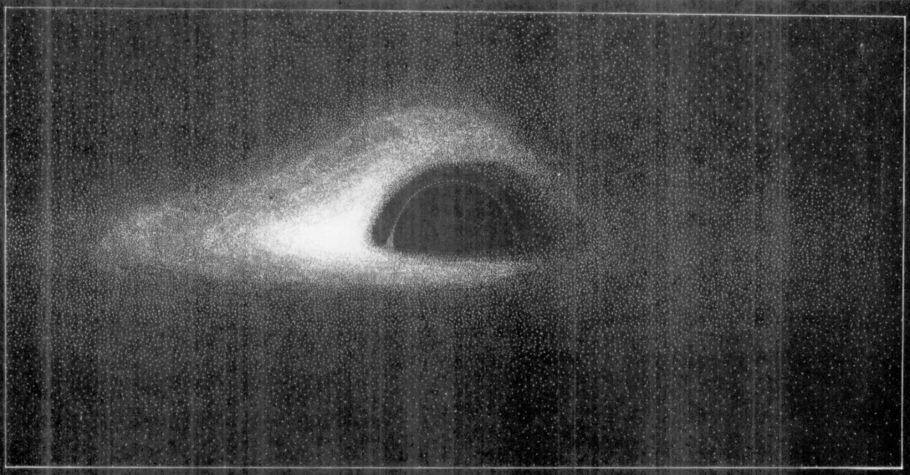

## Simulating an image of a black hole

What would it look like if we could take a picture of a black hole? As it turns out, it looks like
this:

But in 1977 nobody knew what these objects looked like. J-P Luminet was the first to produce a
simulated image of a black hole in a paper published that year:

I have no idea what kind of computer was used to produce this image, but I'm guessing he used punch
cards. With modern computers, how hard could it be to recreate this result? As it turns out, it's
pretty tricky. Here's my effort:

If you want to learn more, [check out my repository](https://github.com/peytondmurray/bhsim).
